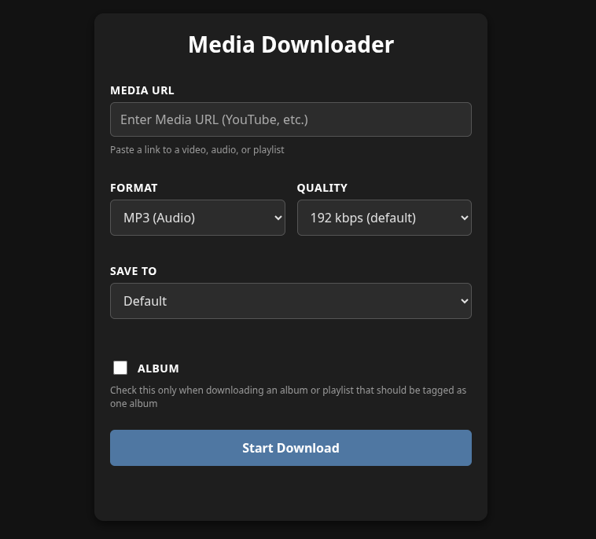

# Media Downloader 🎵
A lightweight, web-based application for downloading and organizing media files.
Includes a modern frontend, Flask backend, and optional Docker support for easy deployment.




## Run Locally (without Docker)

### Clone
```bash
git clone https://github.com/iamValen/media-downloader.git
cd media-downloader
```

### Create Virtual Environment
```bash
python3 -m venv venv
source venv/bin/activate     # on Linux / macOS
venv\Scripts\activate        # on Windows
```

### Install pip and requirements
```bash
pip install --upgrade pip
pip install -r requirements.txt
```

### Configure download paths

By default, downloads are saved to:
- Default Path: ~/Downloads/media_downloader
- Alternative Path: ~/.cache/media_downloader

To customize these paths, you can set environment variables before running:

```bash
export DEFAULT_DOWNLOAD_PATH=/desired/path
export ALT_DOWNLOAD_PATH=/desired/path
```

(Windows PowerShell equivalent)
```shell
$env:DEFAULT_DOWNLOAD_PATH = "D:\desired\path"
$env:ALT_DOWNLOAD_PATH = "C:\desired\path"
```

### Run it
```bash
python app.py
```


## Docker Deployment

### Using Docker run command
```bash
# Build the image
docker build -t media-downloader .
```
Run the container image

  Change <PATH1-IN-HOST> and <PATH2-IN-HOST> for the desired paths where the files will be downloaded to.
  If you just want one download path remove "-v $<PATH2-IN-HOST>:/app/downloads2 \"

```bash
docker run -d \
  -p 5000:5000 \
  -v $<PATH1-IN-HOST>:/app/downloads \
  -v $<PATH2-IN-HOST>:/app/downloads2 \
  -e DEFAULT_DOWNLOAD_PATH=/app/downloads
  -e ALT_DOWNLOAD_PATH=/app/downloads2
  --name media-downloader \
  media-downloader
```

### Using Docker Compose
```yaml
version: '3.8'

services:
  media-downloader:
    build: .
    ports:
      - "5000:5000"
    volumes:
      - ./downloads:/app/downloads
      - ./temp:/app/temp
    restart: unless-stopped
```

Then run:
```bash
docker-compose up -d
```

# To-do
- [X] Frontend Warning to use only public/unlisted and explain that it creates folders: artist/album
- [ ] Video Thumbnail
- [ ] Cancel option 

- [ ] Types

- [ ] Login - PAT/JWT ?
- [ ] Ditch links and make it search
- [ ] Recommend music based on input/profile

- [ ] Logs